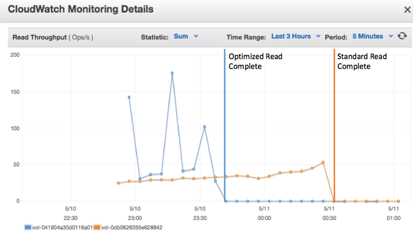
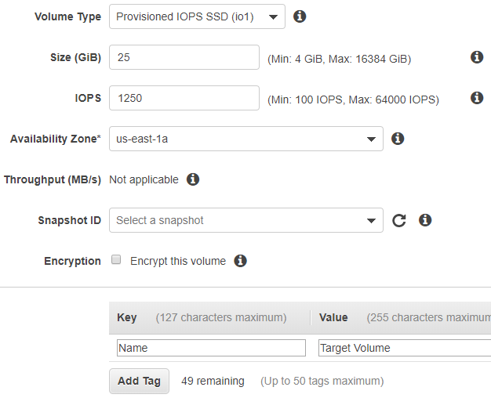
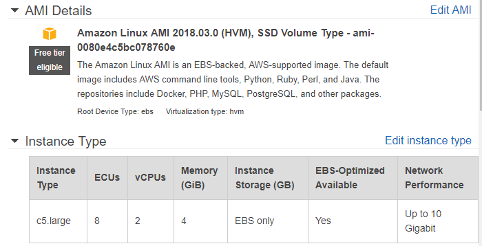
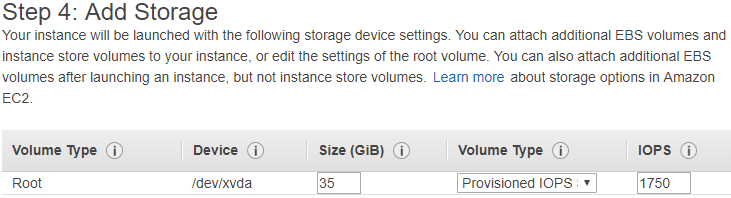
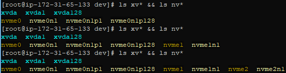
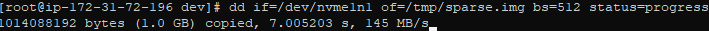
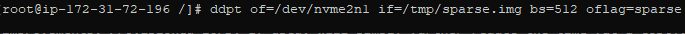
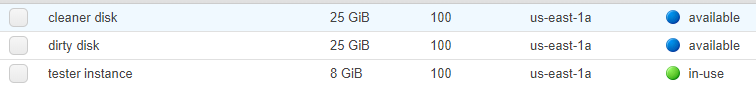
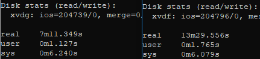
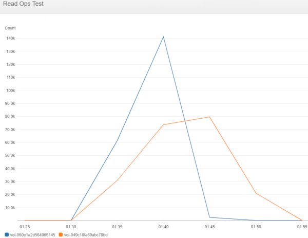

**_In short_**: This article will help you take an existing snapshot and reduce the initialiation time of dirty snapshots (snapshots that contain large amounts of deleted data) by removing the dirty blocks from your snapshot. Combined with a tool like `fio` or `dd` to read over the disk, your initialization times should be reduced.

<!--more-->

## Introduction
One of the interesting parts of my job is maintaining "golden images" for our EC2 fleets. With minor changes and re-imaging over time, we've noticed it took longer and longer to [initializing the volumes](https://docs.aws.amazon.com/AWSEC2/latest/UserGuide/ebs-initialize.html). The initialization process, as you can see at the link, is an AWS recommendation for servers with workloads that want to pre-warm their drives so future access will have consistent, predictable performance that doesn't exist when you first restore a volume form a snapshot. By going through this process, you front-load the initial ~30ms/file access penalty you will see as EBS looks up the source data and pulls it more locally to your instance.

Unfortunately, initialization easily takes ~1 min/GB on a t2.medium using General Purpose SSD storage (and the storage class is the controlling factor here). What's worse, this process takes ~1 min/GB _including_ deleted files that may be lingering from _any preceding snapshot_! There is a bright point though: _If EBS knows the block has never been touched, every, it doesn't get this performance hit_. This means if we can remind EBS which blocks matter, we can decrease initialization times!

I've not found the perfect solution yet, but below I'll show how this process can make significant progress on dealing with these _"dirty disk"_ snapshots. In my experiences with quick `restore -> system update -> snapshot` processes, one of our golden images that had been through this process ~8 times saw a 60% reduction in the initialization time (the `fio` over the disk after bootup).

Before I go further, I should credit [Ian Scofield and Mike Ruiz's](https://aws.amazon.com/blogs/apn/how-to-build-sparse-ebs-volumes-for-fun-and-easy-snapshotting/) AWS Blog post; it was a life-saver for me, and a lot of what I do below owes credit to their posts' technical guidance. I highly encourage reading the blog post for more details on the background, but I will summarize most of the important parts.

## Overview of the Process/Goal
The goal of this entire process is essentially to ensure the EBS volume we write contains **only** files that actually exist, and **drops** any blocks of data that contain lingering file fragments from deleted files. In a physical disk sense, imagine we were to copy files from an old disk to a brand new disk -- the new disk will contain none of the deleted files lingering in the old disk. As described above, these deleted files also impact initialization, so we're going to be able to initialize the entire disk faster!

<p align="center">
<br/>
Example result of this process. Credit: <a href="https://aws.amazon.com/blogs/apn/how-to-build-sparse-ebs-volumes-for-fun-and-easy-snapshotting/">Ian Scofield and Mike Ruiz's Blog Post</a></p>

## Getting Started
First, I should warn you: if you try and do any of these steps on your own, keep in mind there are costs associated with this as we're not sticking to free-tier stuff. Don't leave lingering running instances and **especially don't leave a provisioned IOPS EBS volume lying around**! While writing this article, it cost me $1 working with 25GB disks. over ~2-3 hours.

### Step 1 - Identify the source volume
This is probably obvious, but there's another important follow-up: Identify the Availability Zone (AZ) it is located in. EBS volumes cannot be attached to instances in different AZs, so you need to ensure the objects you create in the upcoming steps match the same AZ! I highly recommend you make a snapshot of your source (if you've not already done so), and create a new Provisioned IOPS disk from the snapshot. My first attempt at this with a 25GB of general purpose storage took far more than my lunch break to complete.

### Step 2 - Create the target volume
Create A blank disk/volume of appropriate size in the same AZ as the source volume. Here again I _highly_ recommend making the target disk a Provisioned IOPS disk. While this costs more, it probably will still save you money since it will directly offset how long your instance runs and you're less likely to be interrupted by colleagues or encounter problems. With the 1250 Provisioned IOPS for a 25GB disk, the _whole process_ for 25GB can be done in under 10 minutes and is much less prone to errors from sleeping computers or disconnects -- it can possibly be Spot-instanced as well!

<p align="center">
<br/>
</p>

### Step 3 - Make a "Transfer" Instance
Now we will make a utility instance that will do the file move. This instance must be created in the same AZ as the existing disks, and you need SSH, [Systems Manager](https://docs.aws.amazon.com/systems-manager/latest/userguide/session-manager.html), or similar access to the machine.

My typical setup -- which I create on-demand, as a provisioned IOPSs disks cost money even when not in use:

- Instance Type: `C5.large` (2vCPU/4GB, $0.02 for ~15 minutes)
  - Note: The C5 generation has the enhanced networking interfaces (ENI), which is helpful. Other options with ENI are also good choices. You can also consider a class of instances with `d` designation if the provided storage is sufficient.
- Disk:
  - Size: `Source Volume Size + 10GB`
  - Type: `1750 Provisioned IOPS` (This is good for <100G)
- Image: `ami-009d6802948d06e52` (Amazon Linux 2 hvm 2018.11.14)

<p align="center">
<br/>
</p>
<p align="center">
<br/>
</p>

Open an SSH connection to this instance as soon as it is ready.

### Step 4 - Instance setup
There's a few quick steps to get this instance ready. SSH into the machine and run the following commands:

```
sudo su -
amazon-linux-extras install epel -y
yum install ddpt -y

# This is only needed for NTFS source/target disks:
yum install -y ntfsprogs
```

These commands switch you over to root and install a version of `dd` that respects/supports sparse images. If you are working with an NFTS disk, be sure to also install `ntfsprogs` as given in the above script. It doesn't hurt to accidentally install it when it's not needed.

### Step 5 - Attach volumes
Recent Amazon linux changes seem to put attached disks as `/dev/nvme#n#` now, instead of `/dv/xvd_` or other placement options, and these never sync up with what the GUI tells you it will be. I recommend going to the `/dev` folder and doing the following `ls` command before attachment, and after each volume is attached. This will give you clear understanding of which volume is attached to what identifier

```
cd /dev
ls xvd* && ls nvme*
```

With an `ls` done on the `/dev` folder, go to the GUI for EBS volumes and attach your two volumes to the instance. **First** attach the source disk, then the target disk. This will keep the lettering/numbering in order!

Here's what it _may_ look like:

<p align="center">
<br/>
</p>

You can see from the above, nvme1 appears to be the source volume, and nvme2 the target. I included xvd* because this depends on your instance type -- an M4 or C4 instance still registers the disks under `xvd_`.

### Step 6 - Make a local copy
Now that we're all set up, we can do the fun stuff!

```
dd if=/dev/nvme1n1 of=/tmp/sparse.img bs=512 status=progress
```
This tells `dd` to copy the `/dev/nvme1n1` disk to an output file('of') of /tmp/sparse.img using a block size of 512. Status=progress informs `dd` we would like updates on the progress as it works.

<p align="center">
<br/>
</p>

Next, we need to mount the image to the local machine, this gives you one last opportunity to make changes before you solidify the image:

#### For linux disks:
The complex offset expression does sector size * start sector to get bytes
```
mkdir /loop && mount -o loop,discard,offset=$(parted -s /tmp/sparse.img unit B print |  awk '/^Number/{p=1;next}; p{gsub(/[^[:digit:]]/, "", $2); print $2}') /tmp/sparse.img /loop
```

#### For NTFS disks:
I've only done one NTFS disk, so I don't have an offset script that I'm positive works. You can try the above offset script in here if you would like, or manually determine it.
```
mkdir /loop && mount -t ntfs -o loop,discard,offset=1048576 /tmp/sparse.img /loop
```

### Step 7 - The Magical FS Trim
This is where the magic happens! You see, when we did `dd` earlier, it did a bit-by-bit copy of the disk, including files that were marked as deleted. This command says it should drop those deleted fragments and ensure unallocated (unused) space is marked as such. We then umount the disk:

```
fstrim /loop
umount /loop
```

### Step 8 - Re-writing the disk
Now, to save all our hard work, we need to copy the fruits of our labour to a new disk:

```
ddpt of=/dev/nvme2n1 if=/tmp/sparse.img bs=512 oflag=sparse
```

This final command writes _only the files that matter_ to the clean "Target" disk we made. This may take a few minutes.

This can take a while, just be patient:
<p align="center">
<br/>
</p>


### Step 9 - New Snapshots / AMIs
At this stage, we have a volume that is nearly perfectly set up for AWS to work with -- the only bits written to this volume are those containing files, and no fragments of past files. We can now go to the GUI and make a snapshot (and AMI, if desired) of this volume. When we do this, the snapshot will have the same sparse quality!

This is especially noticeable when you want to initialize your disk. As I showed before, this can be a huge performance gain (especially if your source disk had lots of transient files, like GBs deleted logs or other files!)

Also note that this is an improvement that is consistent with your disk type -- You don't need provisioned IOPS to see the above improvements... General purpose disks will get the same latency improvements. Provisioned IOPS, if used, will simply further reduce the time (at a cost).

### Step 10 - Sample results
You can do this to verify how much of an improvement this is for you. For the below test, I did nothing fancy -- these are general purpose disks on a basic C4 instance.

<p align="center">
</p>

1. Create 2 volumes, one that is based on the clean snapshot, one from your older dirty snapshot
2. Attach both volumes to an instance
3. Run the following command on both disks, be sure to change the name and disk<br />
`time fio --rw=read --bs=128k --iodepth=32 --ioengine=libaio --direct=1 --filename=/dev/____ --name=disk-test-_`
4. Wait for the results
<p align="center">
<br />
Optimized disk image (left) vs Unoptimized disk image (right).</p>
<p align="center">
<br />
Optimized disk image (blue) vs Unoptimized disk image (orange). Note: Reporting delays cause both lines to look a bit worse than reality.</p>

From these, you can see an `fio` on the disks saw almost a 50% improvement. Meanwhile the optimized disk actually achieved higher IOPS due to the improved efficiency, which allowed the faster read of the disk.
