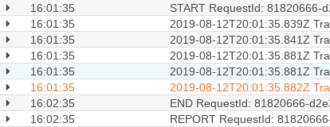
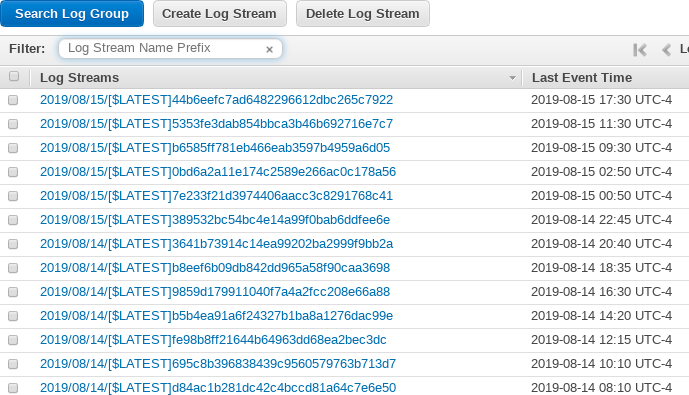
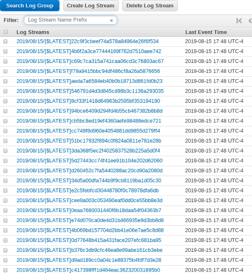

**Summary**: AWS Lambda through API Gateway binds requests to lambdas in 1:1, which means cold starts are likely if you recieve more parallel requests than you have lambdas available to de-thaw. For more information, read below...

<!--more-->

## Introduction
This article started as a background thought, and became a real concern as my organization moved away from ECS and docker containers running Node.js based server code to a serverless environment using API Gateway and a Node.js runtime Lambda. The goal of this mini-project was to investigate how AWS handles API Gateway requests to AWS Lambda in the proxy integration when multiple concurrent requests are recieved within the same execution window.

## Initial Thoughts
Looking at logs from a Lambda, it _appears_ fairly obvious that a Lambda can only process one request at a time; unlike typical Node applications that can process requests in parallel, API Gateway takes the request and synchronously invokes a lambda function. This is fairly obvious if you look at logs, where you will see `START`, `END`, and `REPORT`, and no intermingled logs within the time it takes to execute. If you consider this a moment, it seems somewhat obvious: API Gateway invoked the lambda and is waiting for a response, so it needs to trigger a synchronus execution and wait for the results.

 
Snippet of a log, examine your own logs and you'll see similar.

As previously stated, the goal is to verify the API Gateway and Lambda integrations. To set this up, I picked an API Gateway-Lambda link that had very light usage, as shown below:

 
Before execution there appears to be only 1 likely frozen lambda that may be <a href="https://docs.aws.amazon.com/lambda/latest/dg/running-lambda-code.html">"thawed"</a> on demanded

Assuming this screen capture was taken shortly after the most recent event time, there's no other event time within even 4 hours, so it is unlikely there is more than 1 loaded lambda. The most recent lambda itself might not be loaded anymore. In order to test this API Gateway-Lambda proxy integration, I made a fairly simple script that promised 50 HTTP requests, and executed them in parallel. It is important to do the requests in parallel, in this case, because back-to-back (serial) requests would not require a second lambda to be available and would defeat the purpose of this test.

Here's the result of firing 50 API requests within milliseconds:

 
Result shows that a large number of lambdas were forced into existance

We can see from this result that AWS' API Gateway spun up 30+ Lambda functions to fulfill these synchronus requests. This is in line wiht what I'd expect as the [default proxy integration is synchronus](https://docs.aws.amazon.com/apigateway/latest/developerguide/set-up-lambda-integration-async.html) unless you provide additional headers with the request. However, if you provide such additional headers, you no longer can get the response codes since this disconnects API Gateway from the Lambda execution. This may be a workable scenario if the requests are fire-and-forget requests that do not need validation back to the user.

## Conclusion

As stated in the summary, AWS Lambda through API Gateway binds requests to Lambda 1:1, which means cold starts are likely if you recieve more parallel requests than you have currently available-to-thaw Lambdas. You can reduce the impact of this kind of issue by [warming](https://read.acloud.guru/how-to-keep-your-lambda-functions-warm-9d7e1aa6e2f0) your API's with periodic -- and importantly, parallel -- requests. The parallel component is crucial: all requests must be sent at the same time or API Gateway will re-use the available Lambda. This means you should look at a multi-threaded warming approach, not a for-loop approach. If you'd like even more information on this topic, [see this article](https://theburningmonk.com/2018/01/im-afraid-youre-thinking-about-aws-lambda-cold-starts-all-wrong/)