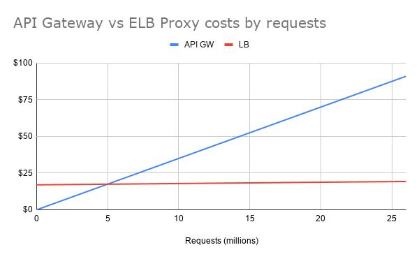

**Summary**: Is API Gateway merely a front end to your Lambda, with no additional configurations? Do you run multiple APIs? Do you see >5 million requests/month in traffic? Perhaps you should switch to an Application Load Balancer Proxy. Here are some considerations.

<!--more-->

## API Gateway

API Gateway, as you are probably aware, is the de facto standard way to invoke a lambda synchronously. It also adds a lot of extra features, like throttling, stages, pre and post processing, among other features. These additional features, however, come at a cost: $3.50 per million invocations.

## Load Balancer Lambda Proxy Integration

If you never heard of this, you can be forgiven. This was relatively new -- [introduced during the tail end of AWS re:Invent 2018](https://aws.amazon.com/blogs/networking-and-content-delivery/lambda-functions-as-targets-for-application-load-balancers/). In short: You can use a load balancer and host/path rules to redirect requests to an AWS Lambda back end. Prior to this feature addition, essentially Lambda was only reachable with API Gateway.

## What's the point?

**Load Balancer integration allows you to have "up to" 50 APIs behind it for a *relatively* fixed cost of $25/month.**

This was a loaded statement... Let me clarify:

* The more you cram onto a load balancer, the higher the impact on overall performance (e.g. rule evaluations). You may hit other limits (like certs).
* The *relatively* fixed costs are in comparison to API Gateway.

Here's another way to look at this:

This makes it fairly obvious: ELB has a fixed ~$17 cost plus the "capacity units" (LCU) variable cost. This variable cost increases in a linear fashion, just like API gateway, but at a slower rate. The exact rate of climb on the load balancer costs is its own calculation, but you're likely to be hitting the connection-related limits. A load balancer that sees an average of 1 "LCU" of traffic all month will cost ~$23, which equates to 64,000,0000 new connections over the month. An equivalent cost in API gateway is easy to calculate: `64 x 3.50 = $224`

## Summary

If you expect under 5 million requests/month across your account for the forseeable future: use API Gateway. Once you see 4-5 million being a concern, if you're still not using any API Gateway features, consider the load balancer proxy. (Also, perhaps investigate if you can handle what API Gateway does for you in your code -- Lambdas bill a minimum of 100ms, so will 1ms to convert a header value really cost you anything?)

I wanted to write this article because we encountered this issue at work and I wanted to dig just a bit deeper. For my personal projects, API gateway is not a cost factor at all -- My websites & APIs do not see even 1 million hits in a month, and probably never will!

Final considerations:

* If the lambda's primary purpose is moving a lot of data, you may fall into the data transfer LCU consideration.
* API Gateway has features that may be time consuming to replicate.
* If your lambda can run at a CloudFront Edge (without needing a backing database) you will have slower responses
* You may suffer an outage if all the AZ's that your load balancer subnets are located in go down.
* Load balancers can automatically health check, keeping some copies of your lambda warm!
* Also remember, you don't have to be all-in on either side! Maybe mix the two for optimal bill management!
