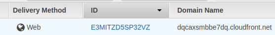
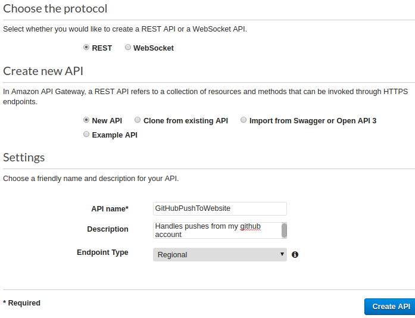

**Summary**: This length article covers a large number of services that can get you from a local hugo site to up and running in a serverless, easily-updated website. We will go over the basics to do an AWS Lambda deploy to AWS S3 + CloudFront of a Hugo static website after you merge to your master branch in GitHub (or GitLab). As an optional bonus step, you can add E-mail and other notifications when this happens. In theory this is applicable to other static website generators, but most of the article is not portable to other cloud vendors since the processor and target are both AWS.

<!--more-->

## Pre-requisites

* This article assumes you have an AWS account with sufficient privileges.
* It is expected you have your website in a git repository.
* As a more complicated article, some easier steps are glossed over.


## Introduction

There can be advantages to off-loading your deployment of your website to an automated serverless CICD pipeline. I personally love the lack of maintenance of this solution, as I can walk away from my website for 1-2 months and I pay nothing for the CICD process. I can also jump right back in with no additional work to reset the CICD setup or re-determine how I build _this_ version of my pipeline (working with pipelines and optimizing things is a portion of my day job).

If you worked on a team, this kind of setup would allow multiple people to branch and merge, and any accepted and merged to master content would be auto-published to your destination. This is probably not the _best_ solution in this case, unless you further add steps to control staged deployments, however this would get you a _development_ website and the files for deployment which you could build on for other deployment stages.

Here's the rough architecture we're aiming for:

<center>


</center>

## A Complex Process

As you can probably tell, this is not an _introductory_ level article. If you're not familiar with some of this, this may take some time to understand and complete. The components involved are:

1. A Git server (GitHub in this article, but GitLab should work) accepts a push (GitLab calls this a merge request, GitHub calls this a pull request). In either event, a [webhook](https://en.wikipedia.org/wiki/Webhook) is triggered where data is sent to the specified HTTPS endpoint (in this case, API Gateway).

2. API Gateway is this specified endpoint you plug into a git server webhook. It takes in a request and forwards the request to the Lambda. While it does this, it maintains the connection to the Git server as well as the Lambda process. The lambda has 29 seconds to complete or the API Gateway will abort the process and return a negative response to the Git webhook. Depending on the size of your website, this may be a concern if you grow to a very large size. If you hit this limit and are curious about next steps, feel free to [contact me](https://ldoughty.com/about).

3. The Lambda receives the request from API Gateway. The code that processes the request is entirely custom. In this process, if the request is a master-branch merge, we will:

   * Use AWS Lambda to download Hugo
   * `git clone` the repo holding the website
   * Run `hugo` inside the Lambda against the branch
   * Push changes to S3 & CloudFront

4. S3 will contain the new updated website, as a result of the Lambda process

5. CloudFront will be invalidated, and will start re-checking files against S3 for changes

6. User requests will hit CloudFront edge and regional caches which are backed by S3, resulting in extremely fast page loads with no servers to manage.

7. (Optional) SNS can be used to notify you of ignored web hooks, or successful rebuilds of the website.

Certificate Manager doesn't have a direct role in any of this, but it holds the SSL certificate that is used by API Gateway to respond to requests from the Git server, and for CloudFront to respond to client requests.

## Certificate Manager

There's not a really great starting point for this article -- there's a lot of components involved. To build this, you need to stand up components from the end and work towards the beginning. Certificate Manager is a good low-hanging fruit that needs to be in place for CloudFront, so let's start there.

Certificate manager is fairly straight-forward. You can probably go to that section and follow the simple process to _Request a Public Certificate_. In lieu of filling this article with very basic screen captures, if you have issues, I'd recommend following the [AWS process](https://docs.aws.amazon.com/acm/latest/userguide/gs-acm-request-public.html) and request a certificate for both `www.yourdomain.com` and `yourdomain.com`. If you have a different subdomain in mind, you're welcome to adjust this as you see fit.

Please start the validation process then return to this article; validation typically is done within 5 minutes if done correctly, but can take an hour in some cases.

## AWS CloudFront

Hopefully your certificate passed validation. Now we can move on to the CloudFront component. We'll want to [create a distribution](https://console.aws.amazon.com/cloudfront/home?region=us-east-1#create-distribution). You'll want to provide the following:

For brevity, if the option should remain in the default state, it is excluded from the following list:

* `Origin Domain Name` will have a drop down that lets you select the S3 bucket you created
* `Viewer Protocol Policy` should be set to `Redirect HTTP to HTTPS` to provide the best user experience
* `Compress Objects Automatically` Set this to Yes. This reduces the file size of data returned to users which is a great benefit for mobile users
* `Alternate Domain Names (CNAMEs)` should be set to your website domain you want to serve this content out of.
* `SSL Certificate` here you should select the certificate you made previously. If it's not validated yet, you might have to return to this section later.
* `Default Root Object` should be `index.html`

That should be it for now. Your distribution will take 10-15 minutes to set up, so lets move on for now. Before you navigate away from CloudFront, grab the cloudfront.net Domain Name provided (see below for an example, your "Domain Name" will be different).

<center>



</center>

## Route 53 (or alternate DNS provider) Setup

Go to your DNS provider and add a CNAME record pointing `yourdomain.com` and/or `www.yourdomain.com` to the CloudFront.net URL you were provided in the last step. If you decided to use a different subdomain, you can obviously use that instead.

## S3 Bucket Setup

This is an easy step. Go to AWS S3 and create a bucket. AWS Buckets must be unique across _all_ of Amazon Web Services, so your first choice may not work. Thankfully, your end-users will not see this bucket, so you can name it `zxcvbnmasdfg` and no one would know. You _can_ use your domain name as a bucket name, but I usually recommend a random or pointless name.

## CloudWatch Log Group

[Make a log group](https://console.aws.amazon.com/cloudwatch/home?region=us-east-1#logs:) called `/aws/lambda/{Expected function name}`. 

## IAM Role for Lambda

* Replace `EXPECTED_FUNCTION_NAME` with the function name you plan to use -- this must match the Log group you made in the previous step.
* Replace `123456789012` with your own account number.
* Replace `BUCKET_NAME` with your S3 bucket name

```json
{
    "Version": "2012-10-17",
    "Statement": [
        {
            "Effect": "Allow",
            "Action": "logs:CreateLogGroup",
            "Resource": "arn:aws:logs:us-east-1:123456789012:*"
        },
        {
            "Effect": "Allow",
            "Action": [
                "logs:CreateLogStream",
                "logs:PutLogEvents"
            ],
            "Resource": [
                "arn:aws:logs:us-east-1:123456789012:log-group:/aws/lambda/EXPECTED_FUNCTION_NAME:*"
            ]
        },
        {
            "Effect": "Allow",
            "Action": "cloudfront:CreateInvalidation",
            "Resource": "*"
        },
        {
            "Effect": "Allow",
            "Action": [
                "s3:PutObject",
                "s3:GetObject",
                "s3:DeleteObject"
            ],
            "Resource": [
                "arn:aws:s3:::BUCKET_NAME",
                "arn:aws:s3:::BUCKET_NAME/*"
            ]
        }
    ]
}
```

If you want SNS support, add this to the end of the statements after replacing `SNS_TOPIC_NAME` with your SNS topic name:

```json
        {
            "Effect": "Allow",
            "Action": "sns:Publish",
            "Resource": "arn:aws:sns:us-east-1:123456789012:SNS_TOPIC_NAME"
        }
```

## AWS Lambda

Now we can start on the interesting stuff!

Go to the AWS Lambda console and create a new function with Runtime 3.7; name this function whatever you like. Select the IAM role you created in the previous step.

Once you go to the next page, you can post this [raw python code](lambda_function.py.txt) into the code window.

Now we need to set a few environment variables:

1. `SITE_SOURCE_ARCHIVE` should be the HTTPS Tarball URL of your website
2. `HUGO_BINARY_ARCHIVE_URL` should be the URL of the version of Hugo you want to use.
3. `BUCKET_NAME` is the name of your bucket
4. `CLOUDFRONT_DISTRIBUTION_ID` is the distribution ID from CloudFront
5. `SNS_TOPIC_ARN` is the SNS topic Amazon Resource Name (ARN) if you want notifications. If you don't set this ENV variable, the code will function without sending notices.

Lastly, you need to increase the Timeout to 29 seconds, and memory to 512MB. The 29 second limit is because the Lambda MUST respond to the webhook within 30 seconds or API Gateway will terminate the connection and the webhook will be re-sent indefinitely. The 512 MB is a bit overkill... If you do a LOT of pushing, maybe drop it lower, but AWS's always-free tier covers a few thousand of these executions per month.

## AWS API Gateway

Now we need to leverage API Gateway to connect the "outside world" to this lambda function. Go to the AWS API Gateway section and create a new REST API. Here are the settings you want to enable:



