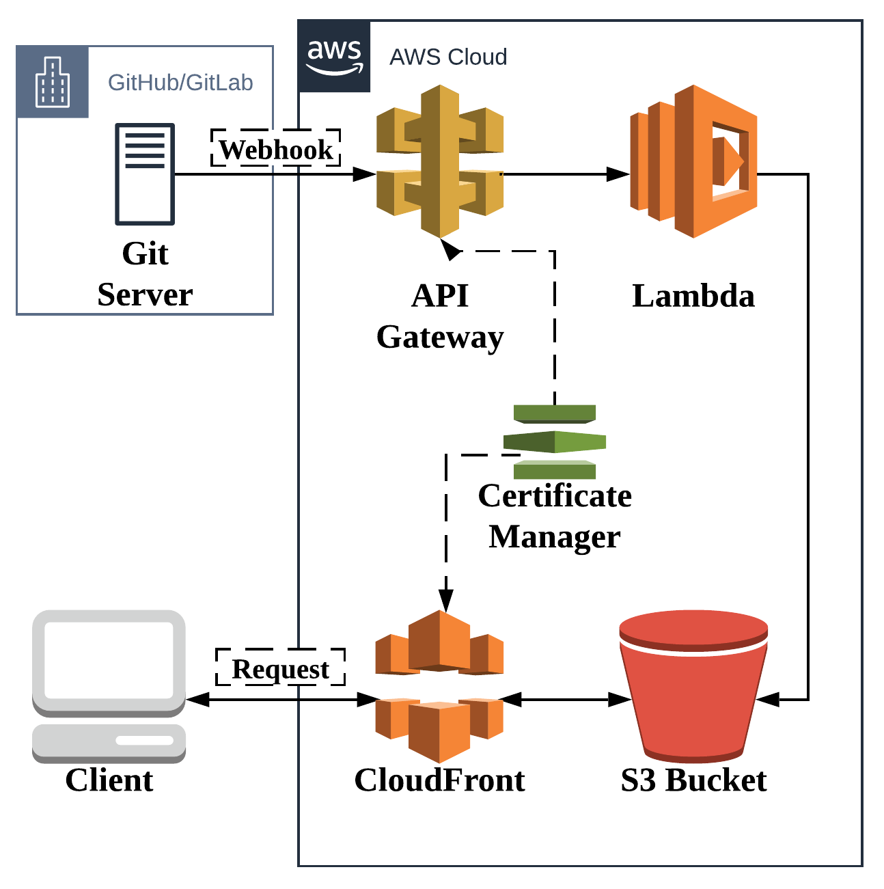

**Summary**: This article will go over the basics to do an AWS Lambda deploy to AWS S3 + CloudFront of a Hugo static website after you merge to your master branch in GitHub. As an optional bonus step, you can add E-mail and other notifications when this happens. In theory this is applicable to other static website generators, but most of the article is not portable to other cloud vendors since the processor and target are both AWS.

<!--more-->

## Pre-requisites

* You will need significant AWS permissions to follow along.
* You will need a GitHub account (though in theory GitLab should also work)
* This is not always a completely free service, so you may be billed for the resulting product. My experience: this costs pennies/month.

## Introduction

There can be advantages to off-loading your deployment of your website to an automated serverless CICD pipeline. I personally love the lack of maintenance of this solution, as I can walk away from my website for 1-2 months and I pay nothing for the CICD process. I can also jump right back in with no additional work to reset the CICD setup or re-determine how I build _this_ version of my pipeline (working with pipelines and optimizing things is a portion of my day job).

If you worked on a team, this kind of setup would allow multiple people to branch and merge, and any accepted and merged to master content would be auto-published to your destination. This is probably not the _best_ solution in this case, unless you further add steps to control staged deployments, however this would get you a _development_ website and the files for deployment which you could build on for other deployment stages.

Here's the rough architecture we're aiming for:

## A Complex Process

As you can probably tell, this is not an _introductory_ level article. If you're not familiar with some of this, this may take some time to understand and complete. The components involved are:

1. A Git server (GitHub in this article, but GitLab should work) accepts a push (GitLab calls this a merge request, GitHub calls this a pull request). In either event, a [webhook](https://en.wikipedia.org/wiki/Webhook) is triggered where data is sent to the specified HTTPS endpoint (in this case, API Gateway).

2. API Gateway is this specified endpoint you plug into a git server webhook. It takes in a request and forwards the request to the Lambda. While it does this, it maintains the connection to the Git server as well as the Lambda process. The lambda has 29 seconds to complete or the API Gateway will abort the process and return a negative response to the Git webhook. Depending on the size of your website, this may be a concern if you grow to a very large size. If you hit this limit and are curious about next steps, feel free to [contact me](https://ldoughty.com/about).

3. The Lambda recieves the request from API Gateway. The code that processes the request is entirely custom. In this process, if the request is a master-branch merge, we will:

   * use Lambda to download Hugo
   * `git clone` the branch
   * run `hugo` inside the Lambda against the branch
   * push changes to S3 & CloudFront

4. S3 will contain the new updated website, as a result of the Lambda process

5. CloudFront will be invalidated, and will start re-checking files against S3 for changes

6. User requests will hit CloudFront edge and regional caches which are backed by S3, resulting in extremely fast page loads with no servers to manage.

Certificate Manager doesn't have a direct role in any of this, but it holds the SSL certificate that is used by API Gateway to respond to requests from the Git server, and for CloudFront to respond to client requests.

## Certificate Manager

There's not a really great starting point for this article. There's a lot of components involved, and to build this you need to stand up components from the end and work towards the beginning. Certificate Manager is a good low-hanging fruit that needs to be done to support both API Gateway and CloudFront, so let's start there.

Certificate manager is fairly straight-forward. You can probably go to that section and follow the simple process to _Request a Public Certificate_. In leiu of filling this article with very basic screen captures, if you have issues, I'd recommend following the [AWS process](https://docs.aws.amazon.com/acm/latest/userguide/gs-acm-request-public.html)

## S3 Bucket Setup

This is another easy step. Go to AWS S3 and create a bucket. AWS Buckets must be unique across _all_ of Amazon Web Services, so your first choice may not work. Thankfully, your end-users will not see this bucket, so you can name it `zxcvbnmasdfg` and no one would know. I usually recommend doing your domain name, or some variation along those lines.

## AWS CloudFront

Cloudfront

## AWS Lambda

## AWS API Gateway

