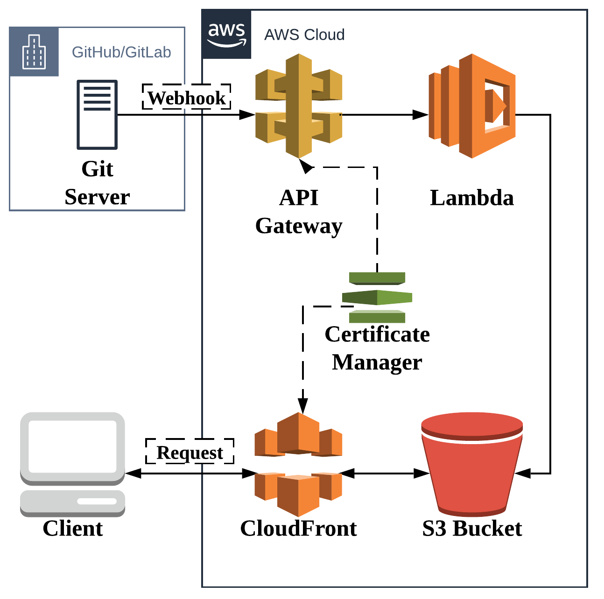

**Summary**: This article will go over the basics to do an AWS Lambda deploy to AWS S3 + CloudFront of a Hugo static website after you merge to your master branch in GitHub. As an optional bonus step, you can add E-mail and other notifications when this happens. In theory this is applicable to other static website generators, but most of the article is not portable to other cloud vendors since the processor and target are both AWS.

<!--more-->

## Pre-requisites

* You will need significant AWS permissions to follow along.
* You will need a GitHub account (though in theory GitLab should also work)
* This is not always a completely free service, so you may be billed for the resulting product. My experience: this costs pennies/month.

## Introduction

There can be advantages to off-loading your deployment of your website to an automated serverless CICD pipeline. I personally love the lack of maintenance of this solution, as I can walk away from my website for 1-2 months and I pay nothing for the CICD process. I can also jump right back in with no additional work to reset the CICD setup or re-determine how I build _this_ version of my pipeline (working with pipelines and optimizing things is a portion of my day job).

If you worked on a team, this kind of setup would allow multiple people to branch and merge, and any accepted and merged to master content would be auto-published to your destination. This is probably not the _best_ solution in this case, unless you further add steps to control staged deployments... However this would get you a _development_ website and the files for deployment.

Here's the rough architecture we're aiming for:

1. A Git server (GitHub in this article, but GitLab should work) accepts a master-branch merge (GitLab calls this a merge request, GitHub calls this a pull request). In either event, a [https://en.wikipedia.org/wiki/Webhook](webhook) is triggered where data is sent to a specified HTTPS endpoint.
2. API Gateway is this specified endpoint. It takes in a request and forwards the request to the Lambda. While it does this, it maintains the connection to the Git server as well as the Lambda process. The lambda has 29 seconds to complete or the API Gateway will abort the process and return a negative response to the Git webhook. Depending on the size of your website, this may be a concern if you grow to a very large size. If you hit this limit and are curious about next steps, feel free to [contact me](https://ldoughty.com/about).
