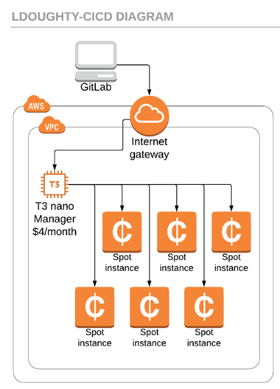

**Summary**: This article will hook up GitLab group (or project) runners to AWS Spot Instances through docker-machine, which in my professional experience gave us ~3-4 extra concurrent workers while reducing our cost by ~60%. This is mostly achieved by only spawning CI/CD instances only as they were needed and getting lower Spot instance rates.

<!--more-->

## Expectation Setting
To be clear, everyone's pipelines are a bit different. This may not be your magic bullet, but in a professional team, this probably will still save you 50-80% over always-on servers. When I joined the [Virginia Cyber Range](https://virginiacyberrange.org), we had a single AWS `M4.large` that was responsible for all builds. This CICD node was also built on an AMI that had support included (which we never used) but also cost us extra pennies/hour. When I redid the setup for the first time, which was in a crunch, I quickly swapped us to 2 `C4.large` instances (as 2 concurrent workers), which basically doubled our costs to double our workers. When I had more time to invest in this, I decided I wanted to use GitLab multi-Runner with docker-machine.

<p style="text-align: center">

</p>

In the end, we now allow developers to spin up up to 25 concurrent `C5.xlarge` workers and with this configuration we now pay less than we did for a _single_ `M4.large` before!

In order to follow the steps, you'll need to be your AWS admin, or be able to work closely with them to make some IAM policies. You'll also need access to the CI/CD section of your GitLab group or project (which typically meains Maintainer of the GitLab repo or group).

At a minimum, this will cost $4/month, even if entirely unused. So if you're super low-budget, you probably want to find alternatives that can embrace Lambda and API gateway to capture merge requests and spawn workers.

## First Steps: IAM Policy
Let's get this out of the way early. Let's go to the IAM section and make a new Role: `GitLab-Runner-Manager-Role`

To this role, attach `AmazonEC2FullAccess`. You're welcome to find the fine-tuned policy to lock this down further, or to attach a [Permission Boundary](https://docs.aws.amazon.com/IAM/latest/UserGuide/access_policies_boundaries.html), but in my experience, I spent 2-3 hours trying to piecemeal attach permissions and found docker-machine simply did so much it was a headache to manage on top of everything else here.

If you plan to use AWS tools in your CI/CD, you probably also will need to make a `GitLab-Runner-Instance-Role`, this will allow your _worker instance_ to get AWS Access keys it needs to do actions like log into ECR, or make changes to your infrastructure.

You will use both of these roles later.

## The Manager
It took me a few iterations to get this right. Hopefully from my lessons learned you can get this up much faster!

The first instance we want to create a _manager instance_ -- it runs no CI/CD code other than acting as a middleman between GitLab and your worker nodes. It will spawn workers and issue them commands; the manger will also forward back logs from actions back to the GitLab log for you to see from the website. For this reason, there is _some_ CPU load during business hours to handle all this back-and-forth, so you'll see in my notes below I recommend upgrading the instance type if you do a lot of long-running builds, or hundreds of builds/day. I highly advise you don't take extra _cost-cutting_ measures like turning off the manager node overnight, as the CPU credits might be needed.

Creation Details:

* Image: `ami-0ac019f4fcb7cb7e6` (Official Ubuntu 18.04 server -- it has the repo's and packages that make this easier than Amazon linux)
* Instance Type: `T3.nano` ($4/month on-demand) (Note: I'd recommend a `T3.micro` if you plan to have 12+ workers during business hours)
* SSH Access (so public IP, SSH key installed)
* 8GB General Purpose disk space is sufficient

## Manager Prep
Obviously, you'll need to SSH (or Systems Manager) into the machine. We'll start by making sure the instance is up to date:

```
sudo apt-get update && sudo apt-get -y upgrade
```

Next we get GitLab CI installed, this will connect the manager node to the GitLab server.

```
curl -L https://packages.gitlab.com/install/repositories/runner/gitlab-ci-multi-runner/script.deb.sh \
 | sudo bash
sudo apt-get install gitlab-ci-multi-runner -y
```

Now for docker-machine; I highly recommend checking for a [more recent release](https://github.com/docker/machine/releases) if available -- bug fixes here can save you money!

```
curl -L https://github.com/docker/machine/releases/download/v0.16.1/docker-machine-`uname -s`-`uname -m` >/tmp/docker-machine \
  && chmod +x /tmp/docker-machine \
  && sudo cp /tmp/docker-machine /usr/local/bin/docker-machine
```

## Build the default image
We need to build the default docker image GitLab sends to the workers, so open this file:

```
sudo nano /usr/lib/gitlab-runner/mk-prebuilt-images.sh
```

Update: `stable ./debian-minbase \` to ==>  `stable ./debian-minbase http://deb.debian.org/debian/ \`

Run the updated script:

```
sudo /usr/lib/gitlab-runner/mk-prebuilt-images.sh
```


## Register the Runner
We're going to need a token, which also makes a `config.toml` file, so run the following command

```
sudo gitlab-runner register
```

You will be asked to enter in a lot of information. Go through the prompts to generate your `config.toml` file.


## Config Setup
Last step! But this is just the beginning -- you'll want to make lots of tweaks to fit your organization and needs. You'll also want to monitor the system to ensure this doesn't cost more than you bargained for. Docker-Machine v0.12 had some _nasty_ bugs that left machines running forever. Since v0.14, that seems to have gone away, thankfully! However, you should always be vigilant.

`sudo nano /etc/gitlab-runner/config.toml`

```
concurrent = 5  # The number of concurrent runners at max
check_interval = 0

[[runners]]
  name = "ip-xxx-xxx-xxx-xxx" # replace me with the real hostname
  limit = 5
  url = "https://gitlab.myorganization.com/"
  token = "4035ada...a05b0c3efcde432" # get me from the register command
  executor = "docker+machine"
  [runners.docker]
    tls_verify = false
    image = "alpine:3.8"
    privileged = true
    disable_cache = false
    volumes = ["/cache"]
    shm_size = 0
  [runners.cache]
  [runners.machine]
    IdleCount = 1
    IdleTime = 1800
    MaxBuilds = 5
    MachineDriver = "amazonec2"
    MachineName = "runner-%s"
    MachineOptions = [
        "amazonec2-iam-instance-profile=Gitlab-Runner-Instance-Role",
        "amazonec2-use-private-address=true",
        "amazonec2-instance-type=c5.2xlarge",
        "amazonec2-vpc-id=vpc-32cxxxxxx",
        "amazonec2-subnet-id=subnet-23faxxxxx",
        "amazonec2-root-size=15",
        "amazonec2-request-spot-instance=true",
        "amazonec2-spot-price=0.18"]
    OffPeakPeriods = ["* * 0-7,18-23 * * mon-fri *", "* * * * * sat,sun *"]
    OffPeakTimezone = "America/New_York"
    OffPeakIdleCount = 0
    OffPeakIdleTime = 300
```

You will really want to look at [the options](https://docs.gitlab.com/runner/configuration/advanced-configuration.html#the-runners-machine-section) available here.

The most important ones:

* `OffPeakPeriods` is a cron expression for off-hours, this determines when to use `IdleCount` vs `OffPeakIdleCount`, among others
* `OffPeakTimezone` is obviously an important distiction to make to have the period understood properly.
* `IdleCount` says how many are kept _waiting_ during business hours
* `IdleTime` is how long a _completed worker_ sits waiting for another job before termination during business hours
* `MaxBuilds` is how many jobs a machine can do before you recycle it
* `MachineOptions` is a [giant collection of additional properties](https://docs.gitlab.com/runner/configuration/autoscale.html#what-are-the-supported-cloud-providers) you should investigate, but most of this is clear. The only one that really isn't is the `amazonec2-spot-price` field, which I recommend setting to your on-demand price for the instance type. This will ensure you nearly always can do builds, and never pay more than you would if you ran the server 24/7. Generally, we've seen this alone is 50% cheaper.

From the above config, you can see we set peak hours, M-F 8am-5:59pm Eastern. During business hours we'd keep 1 worker in wait always, and we could build _up to_ 5 concurrent workers. If there was a break of non-use, we'd spin back down to a minimum of 1. After peak, we have no idle workers (which adds ~2 minutes to CICD time), but if one of them did spin up, we'd keep it around for 5 minutes to make staged builds flow into each other with less delay. Of course, our developers could still have up to 5 concurrent builds off-hours, it's just slightly slower, and less forgiving.


## Final Notes
I hope you found this helpful! Unfortunately, I developed this over several weeks, so if there are any mistakes, drop me a line at ldoughty@vt.edu so I can correct them.